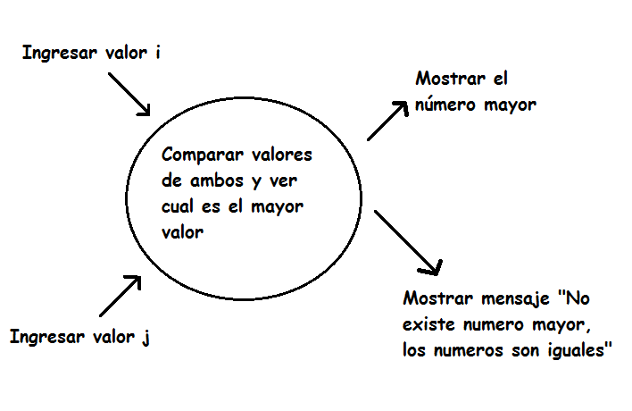

# 051-04-02-Mayor

# Integrantes
* Ramiro Balsa
* Melina Cuellar
* Agustin Sebastian
* Yamil Alejandro Lopez
* Ignacio Muñoz

# Enunciado
* Dado dos números informar cuál es el mayor.

# Análisis

# Lexico

   i,j -> entero
  
   k = 0
	 
	 if (i>j)
   
   else if (i<j)
   
   else if (i==j)

# Algoritmo
* Declarar 2 variables de tipo entero; "i", "j", ϵ Z
* Ingresar variable "i"
* Ingresar variable "j"
* Verificar si "i" es mayor a "j".
* Mostrar el número mayor.
* Verificar si "j" es mayor a "i". 
* Mostrar el número mayor.
* Verificar si "i" y j" son números iguales.
* Si lo son, mostrar el mensaje: " No existe numero mayor, los numeros son iguales " y finalizar.

